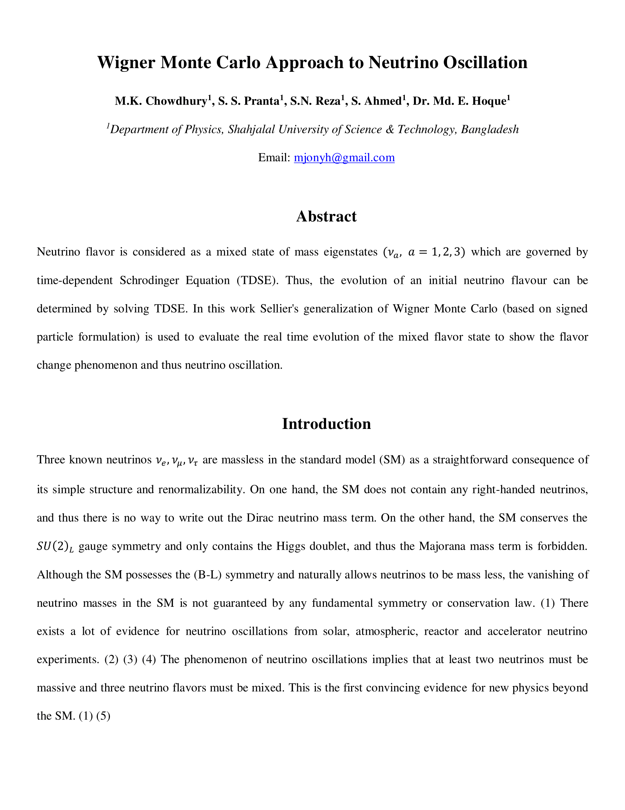

# WIGNER MONTE CARLO APPROACH TO NEUTRINO OSCILLATION

This work was submitted by the team "Nemiran" for the required project of Computational Physics-II (PHY455).

### **_Abstract_**

_Neutrino flavour is considered as a mixed state of mass eigenstates (ν_a,a = 1,2,3) which are governed by time- dependent Schrodinger Equation. Thus, the evolution of an initial neutrino flavour can be determined through solving TDSE. In this approach the Sellier’s generalization of Wigner Monte Carlo (based on signed particle formulation) is used to evaluate the real time evolution of the mixed flavour state to show the flavour change phenomenon and thus neutrino oscillation._

The source code of this project was a mere conversion to python of Jean Michel Sellier's implementation of (ballistic) single-body Wigner Monte Carlo method based on the signed particle formulation of quantum mechanics.

### **Team Members**:
Shakir Ahmed                (s.ahmed7733@gmail.com) (shakir.ahmed@student.sust.edu)
Syed Navid Reza             (snr27.reza@gmail.com)
Suhrid Saha Pranta          (suhridsaha584@gmail.com)
Mahiyath Karim Chowdhury    (mahiyath.hiya.18@gmail.com)

 
### **Acknowledgement**:
Asst. Prof. Dr. Md Enamul Hoque, Assistant Professor, SUST              (mjonyh@gmail.com)
Prof. Dr. Dr. Syed Badiuzzaman Faruque, Professor, SUST                 (awsbf62@yahoo.com)
Lecturer Jaseer Ahmed, Lecturer, SUST                                   (jaseer-phy@sust.edu)
Prof. Dr. Jean Michel Sellier, MILA, Montr´eal, Qu´ebec, Canada         (jeanmichel.sellier@gmail.com) [nano-archimedes.com](nano-archimedes.com)

The original C++ code for Wigner Monte Carlo method can be found at [nano-archimedes.com](nano-archimedes.com). 
